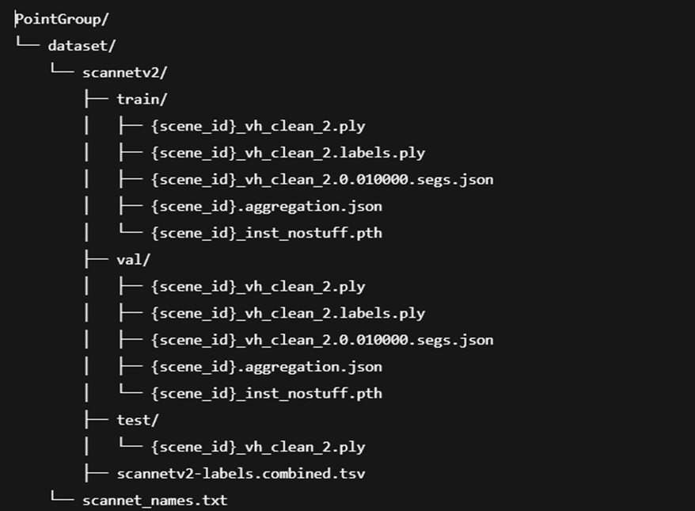

# 3D Segmentation of Oil palm Bunches and Fronds for Autonomous Harvesting

This file documented common instruction to apply dataset processing , labelling , training , validation ,testing and evaluation on Stratitfied Transformer for palm oil 3D point cloud segmentation.

Official Github Implementation of Stratified Transformer : [**Stratified Transformer for 3D Point Cloud Segmentation**](https://github.com/dvlab-research/Stratified-Transformer?tab=readme-ov-file)


## Model Overview 
<div align="center">
  
</div>


# Get Started

Clone Repository 

```bash
git clone https://github.com/swlee123/fyp_3DSegmentation-of-Oil-palm-Bunches-and-Fronds-for-Autonomous-Harvesting.git
```
## Environment Setup 

The setup in official github lack of certain information and detail instructions.
ST setup only works for Linux , as certain dependencies requires file that is only available in Linux, so I opt to use WSL on my Windows machine.

```  
Window Subsystem for Linux (WSL)   20.04 
Python                             3.7.4 
torch                              1.10.0+cu113
Cuda Toolkit                       11.3
GCC                                7.5
```


1. Install WSL 

Installed Ubuntu 20.04 using the Microsoft Store

Open `cmd` and input the command
```
wsl
```
Make sure to set default WSL Distribution to the Ubuntu environment
```  
wsl --set-default Ubuntu-20.04
```

List out all the distribution available 
```
wsl --list --verbose
```

Start the Ubuntu sys in WSL
```
wsl -d Ubuntu-20.04
```


2. Install python 3.7.4 in WSL

Get python 3.7.4 
```bash
sudo apt update
sudo apt install build-essential zlib1g-dev libncurses5-dev libgdbm-dev libnss3-dev libssl-dev libreadline-dev libffi-dev wget

wget https://www.python.org/ftp/python/3.7.4/Python-3.7.4.tgz
sudo tar xzf Python-3.7.4.tgz
```

Then install
```
cd Python-3.7.4

sudo ./configure
sudo make
sudo make install
```

Set python3.7 as default version 

```bash
sudo update-alternatives --install /usr/bin/python3 python3 /usr/local/bin/python3.7
```

3. Install CUDA 11.3 

For Cuda toolkit installation : https://developer.nvidia.com/cuda-11.3.0-download-archive?target_os=Linux&target_arch=x86_64&Distribution=WSL-Ubuntu&target_version=2.0&target_type=deb_local

Tips : directly using wget in WSL is x10 slow, can try to curl or download in Window first then move it to WSL directory to gain access 

4. Install gcc 7.5 in WSl

```bash
sudo add-apt-repository ppa:jonathonf/gcc
sudo apt-get update
```

Then run 

```bash
apt-cache search gcc-7
```
Install `gcc-7`
```bash
sudo apt install gcc-7

```
verify with 
```bash

gcc-7 --version
```
Set GCC-7 as default ( if have another gcc version)

```bash
sudo update-alternatives --install /usr/bin/gcc gcc /usr/bin/gcc-7 70
sudo update-alternatives --config gcc
```


## Dependencies Setup

1. Virtual Environment 

Or you can use `/stenv` directly to skip installation for virtual environment 

```bash
python -m venv env  

source env/bin/activate
```

2. Install dependencies

```
pip install -r requirements.txt
```


3. Compile pointops

Make sure you have installed `gcc` and `cuda`, and `nvcc` can work (Note that if you install cuda by conda, it won't provide nvcc and you should install cuda manually.). Then, compile and install pointops2 as follows. 
```
cd lib/pointops2
python3 setup.py install
```


### Common error and fix 

`ImportError: No module named bz2` 
fix : https://stackoverflow.com/questions/12806122/missing-python-bz2-module

` 'torch' module not found error` even `torch==1.10.0+cu113` is installed 
fix : pip install wheel


## Datasets Preparation

Labelled 3D palm oil dataset could be download from this [link](https://numcmy-my.sharepoint.com/:f:/g/personal/hcysl6_nottingham_edu_my/EnT6oLlGJFtMtWiicopHxdkBeWSrbb75L_oAZCrR_OSBvg?e=xXqNjq)

> Converting from labelled `.ply` file to `Scannetv2` format :

For example we have `L15-P30_labelled.ply`

1. Rename to `scene0150_30_vh_clean_2.labels.ply`

2. Open `CloudCompare` ,import the file and remove label to save it separately as `scene0150_30_vh_clean_2.ply` 

3. Use `Cloudcompare` to save `scene0150_30_vh_clean_2.labels.ply` into another file in `.txt` format, should be like `scene0150_30_vh_clean_2.labels.txt`

4. Use [generate_agg_segs.py](fyp_util/generate_agg_segs.py) to generate 2 other files : 

```bash
python generate_agg_segs.py "scene0150_30_vh_clean_2.labels.txt"
```

Expected file output : 
`scene0150_30.aggregation.json`, 
`scene0150_30_vh_clean_2.0.010000.segs.json`


### Expected files for each labelled data : 
`{scene_id}_vh_clean_2.ply`
`{scene_id}_vh_clean_2.labels.ply`
`{scene_id}.aggregation.json`
`{scene_id}_vh_clean_2.0.010000.segs.json`

After that, put those data in `train/` `val/` and `test/` accordingly, dataset folder is in `PointGroup`

> Generating `.pth` file for all data:

Using [prepare_data_inst.py](PointGroup/dataset/scannetv2/prepare_data_inst.py)

```bash
python prepare_data_inst.py --data_split train
```
Expected output : `{scene_id}_isnt_nostuff.pth`

Final data folder structure should look like this : 



Then change the `data_root` entry in the .yaml configuration file accordingly.

And now we are ready for training/validation/testing.


### ScanNetv2 format 
For more information , please refer to https://github.com/dvlab-research/PointGroup for more details of ScanNetv2 format data preparation instruction. 


## Training

Change `train_id`,`excel_folder`,`data_root` and `save_path` in config file. 

Edit `excel_folder` accordingly so output file will be save in /training/train_{train_id} 

Then run the follosing command :

### ScanNetv2
- Stratified Transformer
```
python3 train.py --config config/scannetv2/scannetv2_stratified_transformer.yaml
```

Expected output : 

`training_logs_{train_id}_mean.csv`
`training_logs_{train_id}.csv`
`validation_logs_{train_id}_mean.csv`
`validation_logs_{train_id}.csv`
`validation_per_class_{train_id}.csv`
and 

Model Weight saved in : 

`runs/sacnnetv2_stratified_transformer/model/model_last.pth`

The trained model weight , to be use for further inferencing.


## Testing
For testing, first change the `batch_size_test` `model_path`, `save_folder` and `data_root_val` (if applicable) accordingly. Then, run the following command. 

```
python3 test.py --config [YOUR_CONFIG_PATH]
```

Prediction output will ba saved as `{scene_id}_inst_nostuff_pred.npy` and `{scene_id}_inst_nostuff_label.npy` in [/npyfile](/npyfile) folder 

> Converting .npy to .ply

.npy is not directly viewable in Cloudcompare , so we need to convert it to .ply for visualization.

[convert_npy_to_ply.py](fyp_util/convert_npy_to_ply.py)
Make sure to edit `txt_file`  `pred_file` and `output_file` variables before running the following command:

```bash
python convert_npy_to_ply.py
```

Expected output : .ply file with prediction results

Then , we can inport the .ply file in CloudCompare for prediction visualization.

## Evaluation

Several scripts is provided in `training/` to do visualizations and analysis on training logs.

`average_loss_all.py`

This script loads training and validation logs from multiple train_X folders (e.g., from LOOCV runs), averages the loss and accuracy across all folds, and plots them over epochs.

`average_validation_per_class.py`
This script aggregates and visualizes class-wise IoU and accuracy metrics across multiple train_X folds using validation_per_class_X.csv files. To use it, ensure each fold directory contains a validation_per_class_X.csv file

`compare_per_class_validation.py`
This script visualizes per-class IoU and accuracy across epochs from a single training fold’s validation_per_class_X.csv. To use it, update the file path to the desired fold and run the script to generate class-wise performance plots.

`compare_train_val.py`
This script compares training and validation performance by plotting mean IoU and mean accuracy over epochs using training_logs_X_mean.csv and validation_logs_X_mean.csv. Update the file paths to match the desired training fold directory before running.

`plot_miou_macc.py`
This script automates the aggregation and visualization of training and validation performance metrics (mIoU and mAcc) across multiple training folds (e.g., train_1, train_2, ...).Per-fold validation mIoU and mAcc values into separate CSV files (total_val_iou.csv and total_val_acc.csv).


`train_val_loss.py`
This script visualizes the training and validation loss and accuracy metrics across epochs from deep learning logs. It processes log files (training_logs_X.csv and validation_logs_X.csv) located in directories like train_1, train_2, etc.

`training_visualizer.py` 
This script visualizes training metrics over time from a single log file (train_6/training_logs_6.csv), plotting loss,accuracy and average loss.


